# `MISP-mcp` Use cases

## What is MCP?

 The **Model Context Protocol (MCP)** is an open protocol designed to standardize how applications provide contextual information to large language models (LLMs). Much like how **USB-C** serves as a universal interface for connecting hardware devices, **MCP acts as a universal connector** between AI models and various data sources or tools. This standardization simplifies integration and enhances the adaptability and functionality of AI-powered applications.

###  Why MCP?

MCP helps you build agents and complex workflows on top of LLMs. LLMs frequently need to integrate with data and tools, and MCP provides:

- A growing list of pre-built integrations that your LLM can directly plug into
- The flexibility to switch between LLM providers and vendors
- Best practices for securing your data within your infrastructure

### General architecture

At its core, MCP follows a client-server architecture where a host application can connect to multiple servers:

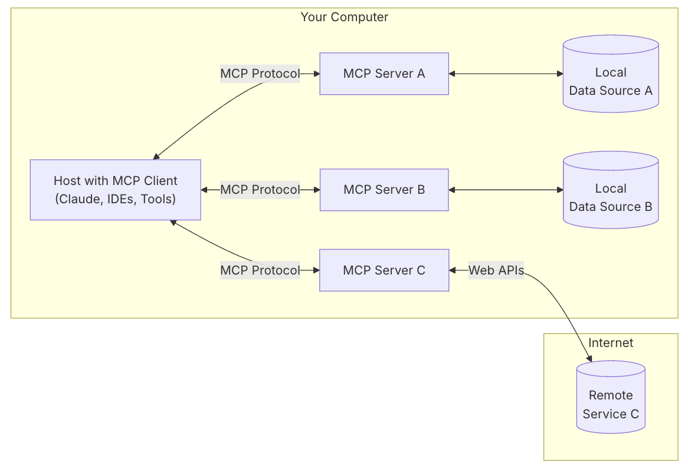

- **MCP Hosts**: Programs like Claude Desktop, IDEs, or AI tools that want to access data through MCP
- **MCP Clients**: Protocol clients that maintain 1:1 connections with servers
- **MCP Servers**: Lightweight programs that each expose specific capabilities through the standardized Model Context Protocol
- **Local Data Sources**: Your computer’s files, databases, and services that MCP servers can securely access
- **Remote Services**: External systems available over the internet (e.g., through APIs) that MCP servers can connect to

## Get started 

1. Clone the repository 

```bash
git clone https://github.com/Eacus/misp-mcp.git
```

2. Install [Claude Desktop](https://claude.ai/download) 

   1. Follow the guide https://modelcontextprotocol.io/quickstart/user
   2. Add the following MCP configuration 

   ```json
   {
       "mcpServers": {
           "MISP-mcp":{
                       "command": "uv",
               "args": [
                   "--directory",
                   "<path_to_repo>/server/",
                   "run",
                   "server.py"
               ]
           }
       }
   }
   ```

3. Restart Claude desktop

## Basic Usage

### Search Event by ID

#### Prompting with `misp-mcp`

> Can you give to me  the MISP event with id 119?

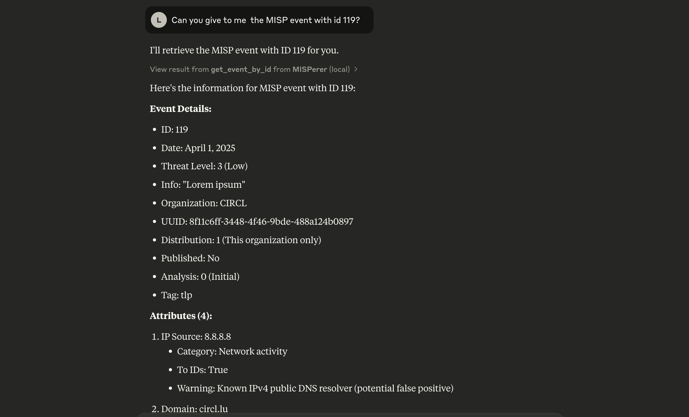

#### GUI

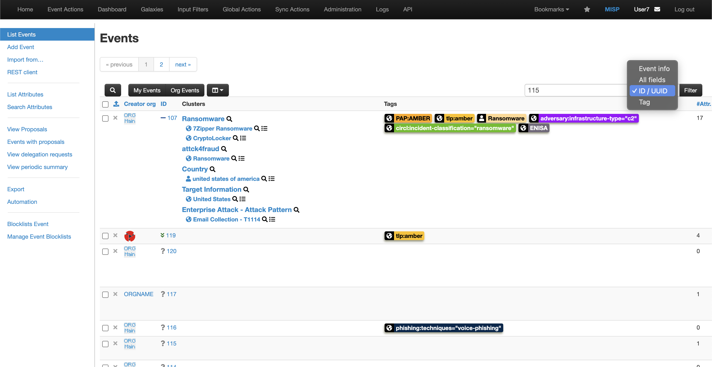

#### PyMISP

```python

misp_url = 'https://127.0.0.1:8443'
misp_key = '<misp_key>'
# Should PyMISP verify the MISP certificate
misp_verifycert = False
r = misp.search(eventid=[119], metadata=True, pythonify=True)
```

### Create an event

#### Prompting with `misp-mcp`

> Create a new MISP event with the following parameters:
>
> - Info: `This is my new MISP event`
> - Distribution: `0` (Your organization only)
> - Threat Level ID: `2` (Medium)
> - Analysis Level: `1` (Ongoing)

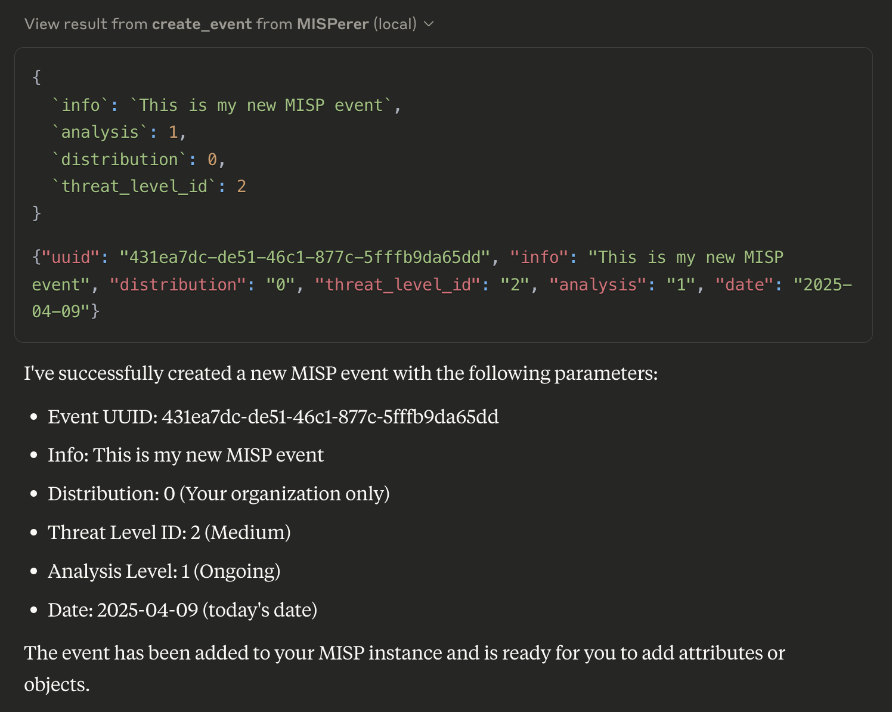

#### GUI

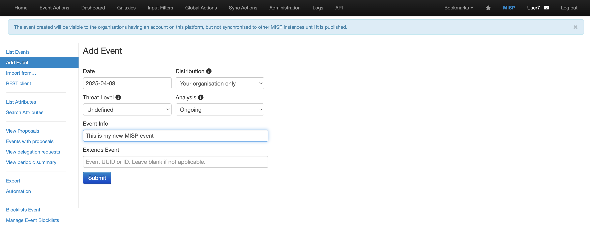

#### PyMISP

```python
from pymisp import MISPEvent

event = MISPEvent()

event.info = 'This is my new MISP event'  # Required
event.distribution = 0  # Optional, defaults to MISP.default_event_distribution in MISP config
event.threat_level_id = 2  # Optional, defaults to MISP.default_event_threat_level in MISP config
event.analysis = 1  # Optional, defaults to 0 (initial analysis)

print(event.to_json())
```

## Administrative task

### Create an user

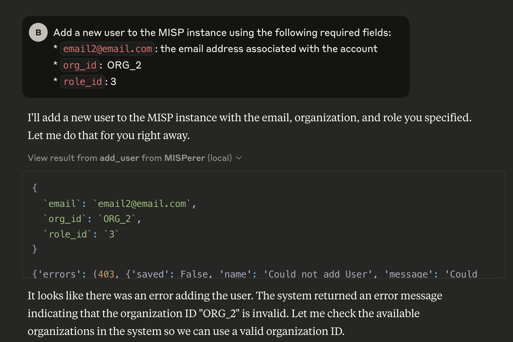

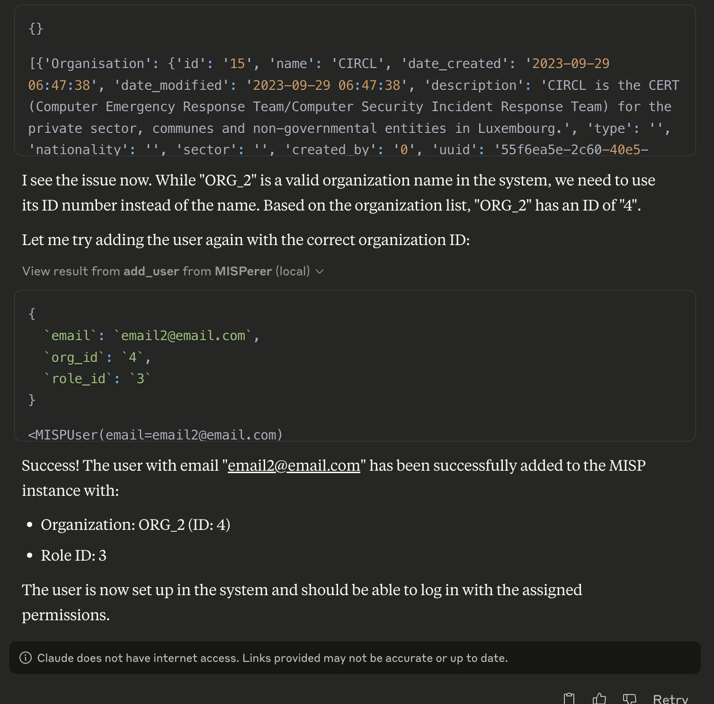

#### Prompting with `misp-mcp`

> Add a new user to the MISP instance using the following required fields:
>
> - `email@email.com`: the email address associated with the account
> - `test_id`: the ID of the organization the user belongs to
> - `role_id`: the ID of the role assigned to the user

#### GUI

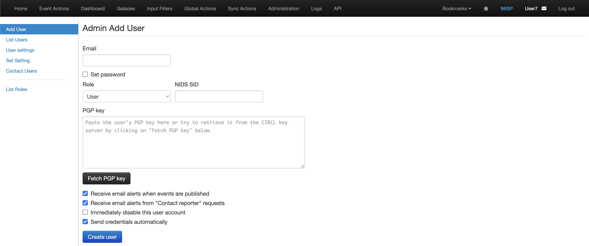

#### PyMisp

```python
from pymisp import ExpandedPyMISP, MISPUser
from keys import misp_url, misp_key, misp_verifycert
import argparse


    misp = ExpandedPyMISP(misp_url, misp_key, misp_verifycert, 'json')

    user = MISPUser()
    user.email = <email>
    user.org_id = <org_id>
    user.role_id = <role_id>

    misp.add_user(user, pythonify=True)
```

## Add AI Capabilities!

> Summarise  all information about the MISP events that happened yesterday?

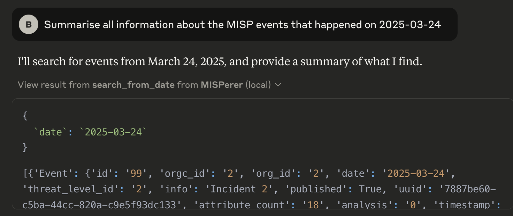


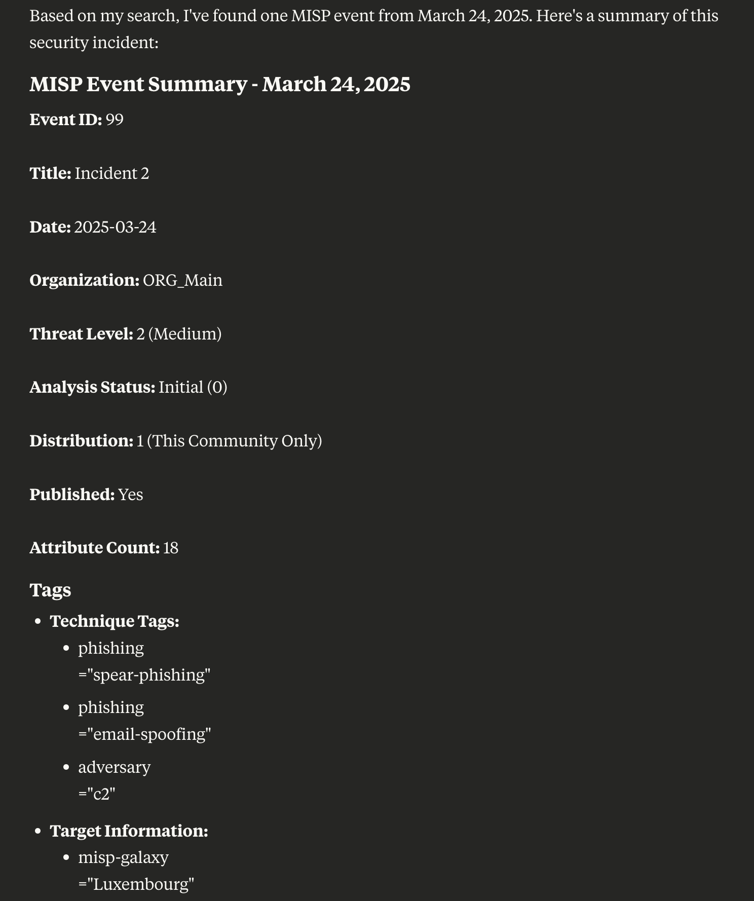

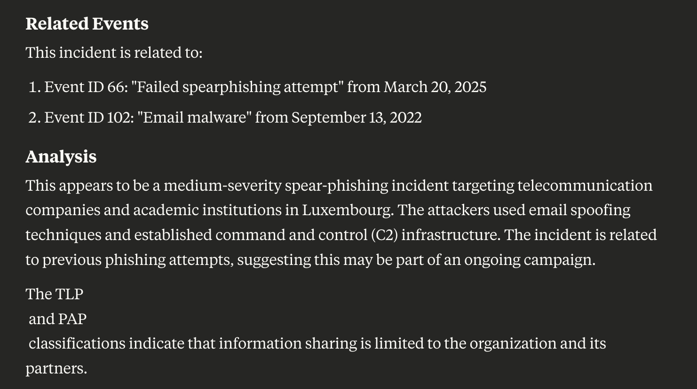

> Generate a report written in Markdown based on the MISP event with id 114 

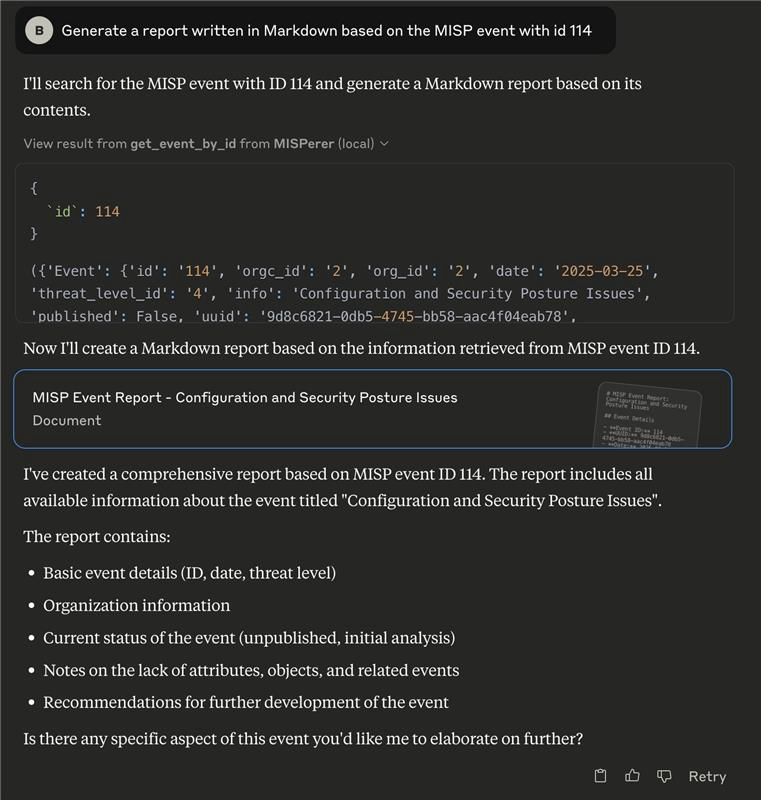

```
# MISP Event Report: Configuration and Security Posture Issues

## Event Details

- **Event ID:** 114
- **UUID:** 9d8c6821-0db5-4745-bb58-aac4f04eab78
- **Date:** 2025-03-25
- **Status:** Not Published
- **Threat Level:** 4
- **Distribution:** 1 (Organization)
- **Analysis Status:** 0 (Initial)

## Organization Information

- **Organization:** ORG_Main
- **Organization UUID:** 3094f85b-a22f-475b-a68f-ae77c233bb72
- **Event Creator:** user88@org-admin.main.test

## Description

This event focuses on "Configuration and Security Posture Issues." It appears to be in an initial stage of analysis and has not yet been published within the MISP instance.

## Attributes

No attributes have been added to this event yet.

## Objects

No objects have been associated with this event.

## Related Events

No related events have been linked to this event.

## Galaxies

No galaxies have been associated with this event.

## Summary

This MISP event (ID: 114) is currently in development and focuses on configuration and security posture issues. The event has been created but does not yet contain any attributes, objects, or relationships with other events. The event is set to be shared only within the organization (ORG_Main).

## Recommendations

1. Add relevant attributes to provide context about the specific configuration and security posture issues being addressed
2. Consider adding objects to structure the information more effectively
3. Link to related events if applicable
4. Determine appropriate galaxies to categorize the threat information
5. Review the threat level assignment to ensure it accurately reflects the severity
6. Consider publishing the event when it contains sufficient information

------

*Report generated on April 9, 2025*
```

